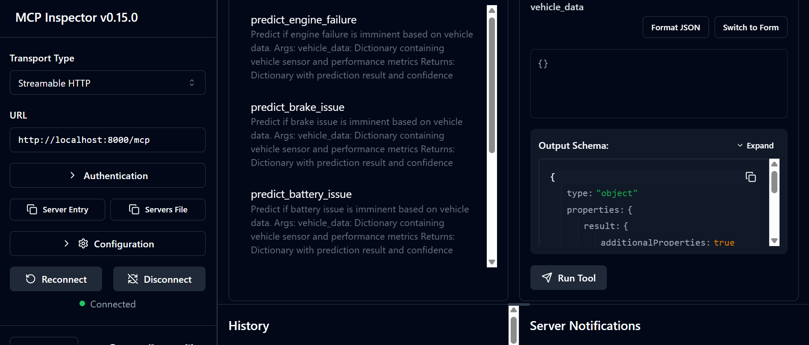
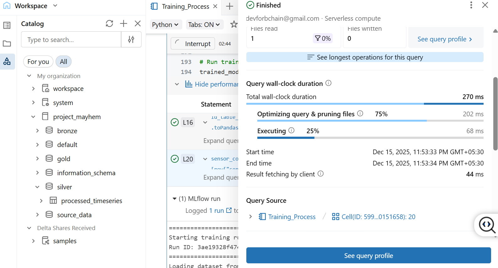
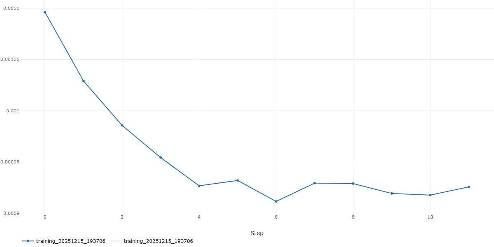
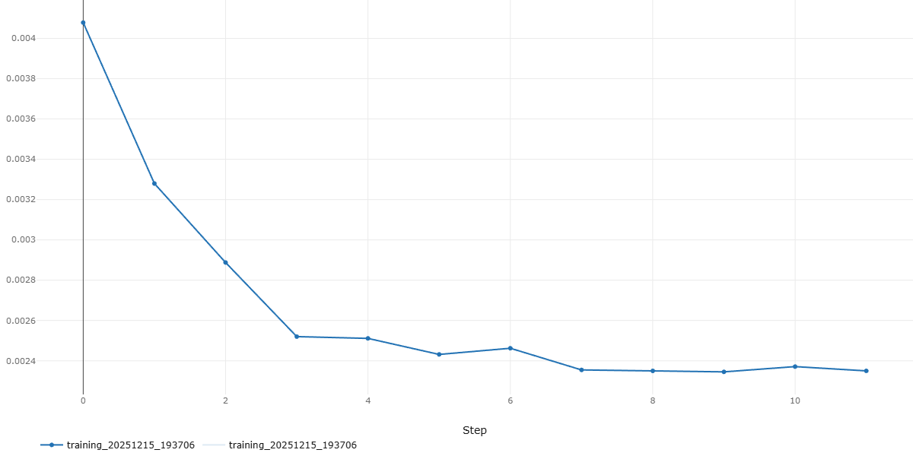
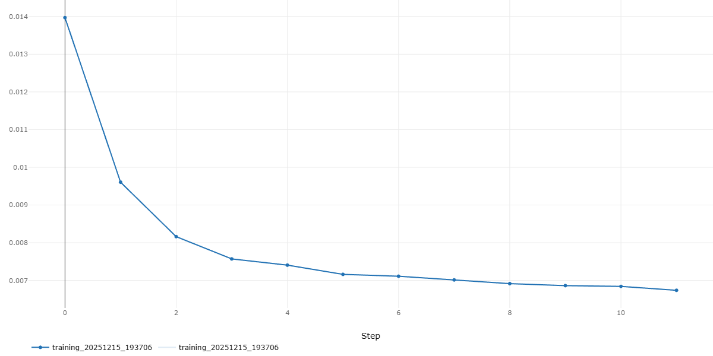
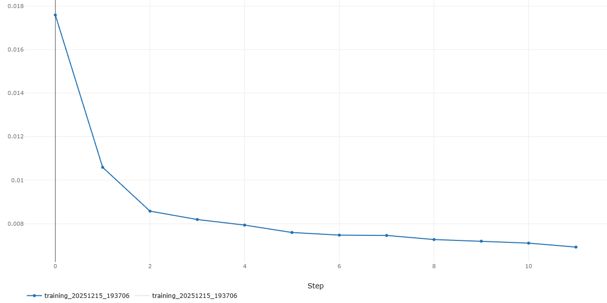
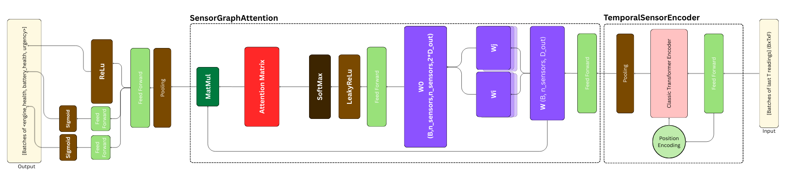

# Data Layer
## Abstract
The data layer is responsible for handling structured and untructured OLAP data
of the project. It is built on [Databricks](https://databricks.com) platform. Most of the actions and pipelines are triggered by Master Agent.  
Conceptually it is divided into two modules - _Individual_ and _Batch_.  
_Individual Module_ gives quick diagnoses of problems taking senor information and unstructured data for customers' on-the-spot problems. _Batch Module_ uses deep learning to analyze more complex relationships among data.

## Contents
- [Individual Module](#individual-module)
   - [Methodology](#methodology)
   - [Tentative Results](#tentative-results)
- [Batch Module](#batch-module)
- [Current Progess And More To Come](#current-progess-and-more-to-come)
    - [Individual Module](#individual-module-1)
        - [Current Abilities](#current-abilities)
        - [Concerns](#concerns)
        - [Improvements](#improvements)
    - [Batch Module](#batch-module-1)
        - [Current Abilities](#current-abilities-1)
        - [Concerns](#concerns-1)
        - [Improvements](#improvements-1)
- [Future Work](#future-work)

## Current Progess And More To Come
### Individual Module
#### Current Abilities

## Individual Module

 server.py - exposes the <b>Data Diagnosis Agent</b> that exposes multiple models and endpoints for the <b>Customer Support Agent</b> to call through MCP endpoints. As it matures it will provide layers of security and allow AI agents to access its tools.  

Dataset: [Vehicle Maintenance Telemetry Data](https://kaggle.com/datasets/tejalaveti2306/vehicle-maintenance-telemetry-data)

### Methodology
We use an ensamble of multiple popular models for regression and classification tasks.  
- For <u>regression</u> of columns (failure_year, failure_month, failure_day) we train Linear regression, Random Forest regression, LightGBM regression and XGBoost regression.  
- For <u>classification</u> of columns (engine_failure_imminent, brake_issue_imminent, battery_issue_imminent) we train Logistic Regression, Random Forest Classifier, LightGBM Classifier, XGBoost Classifier and Support Vector  Classifier.

### Tentative Results
After experimentation, we found that the best performing model for each task is:
- **RandomForest** (for year and day only) and **XGBoost** (for month prediction only) for __failure_date__.
- **RandomForest** for __engine_failure_imminent__
- **XGBoost Classifier** for __brake_issue_imminent__
- **RandomForest Classifier** for __battery_issue_imminent__

## Batch Module
 
The [batch](./batch) directory contains some code (notebooks) directly hosted on Databricks.  
It contains a sample ETL pipeline responsible for re-training and saving the weights of model after enough new data has arrived to meaningfully change the trends.  
The data is processing follows proper medallion architecture.

This pipeline will be updated with addition of Supabase (Postgres) as primary data lake.

The model is a powerful Graph Attention Transformer (GAT) optimized for spacial-temporal data. It shows remarkable results even achieving [Double Descent](https://pmc.ncbi.nlm.nih.gov/articles/PMC9879296/) phenomenon.
<table>
    <tr>
    <td>
battery_loss
</td>
    <td>
engine_loss
</td>
    </tr>
    <tr><td>
    
val_loss
</td>
    <td>
urgency_loss</td></tr>
</table>
Model Architecture Diagram:

(More description of the model can be found <a href="https://github.com/ProjectMayhemAutomotive/DataLayer/blob/main/batch/README.md">here (the report is too interesting to ignore btw)</a>)

## Current Progess and More to Come
#### Individual Module
##### Current Abilities
Can diagnose a problem given relevent sensor data through RAG.  
It is yet to reach its full potential. While it is not as strong and effective as heavy deep learning models, it is still very useful for **quick diagnosis of problems** and that is exactly what we plan it to be.  
##### Concerns
- Due to **lack of good data** the results might seem lackluster but it still has the potential to solve customer needs.
- The server is entirely reliant on RAG from Customer Support Agent and violates the principle of isolation.

##### Improvements
- Although this field is being actively research much of the work is not public. The widely accessible literature shows the potential of unstructured data like __text__ and __images__ to be used for diagnosis. [Predictive Maintenance in IoT Using NLP Techniques](https://osuva.uwasa.fi/items/0e84ff55-4fac-4db0-92d9-cb352c006add)   
- We plan to add more embeddings and integrate directly with database to decrease reliance on RAG.

#### Batch Module
##### Current Abilities
- Can retrain model with new data and save weights. This ensures that it does not become irrelevent as time passes.
- Can parallely process thousands of customers' data and inform them in advance.
##### Concerns
- The model is not yet trained on real data. It is trained on synthetic data for testing purposes.
- The External Communication Layer is yet to be mature enough to test.
##### Improvements
- The model is being trained on real data and will be deployed to production soon.
- The model will be integrated with database to serve predictions for new data.
- The model will be optimized for better performance and accuracy.

## Future Work
- Complete multiple ETL pipelines for next rounds.
- Try better datasets.
- Simulate the behaviour of sensors.
- Integrate completely with Postgres.